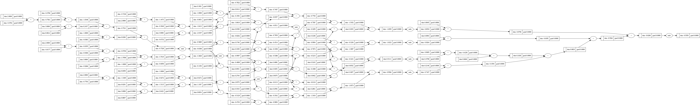

<a name="readme-top"></a>


<!-- PROJECT LOGO -->
<div align="center">


  <h2 align="center">
    Auto Gradient
  </h2>
</div>


<div>
<div align="center">
    
</div>

<br/>
<br/>

Library for storing derivatives and calculating loss gradients.
<br/>
Based on Andrej Karpathy's [micrograd](https://github.com/karpathy/micrograd)
<br/>
<br/>
Neural network 'learning' involves incrementally adjusting the model's parameters, based on the gradient of the loss function.
<br/>
<br/>

These adjustments are made in the direction that _minimizes_ the loss function, a process called gradient descent.
<br/>
<br/>

To derive these gradients, all operations and their inputs during the forward pass must be tracked so that their derivatives can be calculated during the backward pass. This process, known as backpropagation, uses the chain rule to efficiently compute these gradients.
<br/>
<br/>

All basic math operators are supported (add, mult, exponentiate, etc.)
<br/>
value.backward() will calculate the gradients and save to each value object in the lineage
<br/>

```python
from autograd import Value

#using basic math operators:
a = Value(-4.0)
b = Value(2.0)
c = a + b
d = a * b + b**3
c += c + 1
c += 1 + c + (-a)
d += d * 2 + (b + a).relu()
d += 3 * d + (b - a).relu()
e = c - d
f = e**2
g = f / 2.0
g += 10.0 / f

print(f'{g.data:.4f}') # prints 24.7041, the outcome of this forward pass

g.backward() # calculate the gradient of g with respect to each parameter in the network

print(f'{a.grad:.4f}') # prints 138.8338, the numerical value of dg/da
print(f'{b.grad:.4f}') # prints 645.5773, the numerical value of dg/db

#using in a neural net:
from nn import MLP
```
<!-- GETTING STARTED -->

## Usage

Clone the repo
   ```sh
   git clone https://github.com/ryansereno/autograd
   ```
Import
   ```python
    from autograd import Value
   ```

<p align="right">(<a href="#readme-top">back to top</a>)</p>


